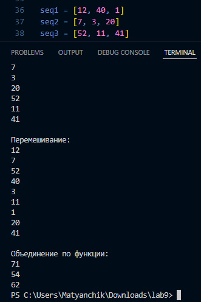

# Лабораторная работа №9
## Вариант 7
Задача: Генератор для объединения последовательностей по заданной стратегии.

## Решение
```
from itertools import zip_longest
import random

def sequence_combiner(strategy='concat', *sequences):
    """
    Генератор для объединения последовательностей по заданной стратегии.
    
    :param strategy: Стратегия объединения ('concat', 'shuffle', 'combine_by_func')
    :param sequences: Последовательности, которые нужно объединить
    :yield: объединенные элементы в соответствии с заданной стратегией
    """
    
    if strategy == 'concat':
        for sequence in sequences:
            for item in sequence:
                yield item
                
    elif strategy == 'shuffle':
        iterators = [iter(seq) for seq in sequences]
        while True:
            for it in iterators:
                try:
                    yield next(it)
                except StopIteration:
                    return
    
    elif strategy == 'combine_by_func':
        def combine_func(*args):
            return sum(args)
        
        for items in zip_longest(*sequences, fillvalue=None):
            filtered_items = [item for item in items if item is not None]
            if filtered_items:
                yield combine_func(*filtered_items)

seq1 = [12, 40, 1]
seq2 = [7, 3, 20]
seq3 = [52, 11, 41]

print("Конкатенация:")
for item in sequence_combiner('concat', seq1, seq2, seq3):
    print(item)

print("\nПеремешивание:")
for item in sequence_combiner('shuffle', seq1, seq2, seq3):
    print(item)

print("\nОбъединение по функции:")
for item in sequence_combiner('combine_by_func', seq1, seq2, seq3):
    print(item)
```


